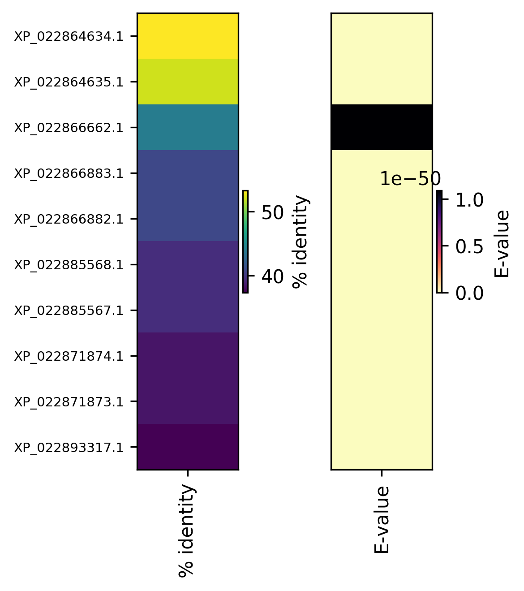

# Project 1 – Filtering BLAST Hits & Visualising Shared Best Hits

**Course:** Linux and Python for Bioinformatics
**Author:** *Aysu Barut*  
**Date:** 22‑Apr‑2025

---

## 0  Quick‑start

```bash
# run the whole pipeline (all three tasks)
python blast_project.py \
       --blast Project1_BLASToutput_2024.txt \
       --fasta wildolive_GCF_002742605.1_protein.faa \
       --outdir results
```

All deliverables are written to the **`results/`** directory:

| File | Purpose |
|------|---------|
| `list1_identity_ge35.txt` | Hits with **≥ 35 % identity** — criterion (a) |
| `list2_evalue_le1e-7.txt` | Hits with **E‑value ≤ 1 × 10⁻⁷** — criterion (b) |
| `shared_hits_heatmap.png` | Two‑column heat‑map (identity & E‑value) of *shared* hits |
| `shared_hits_sequences.fasta` | FASTA sequences of the *10* shared best hits |

---

## 1  Answers to Assignment Questions

### 1) Compile two lists & compare

| Category | # Hits |
|----------|------:|
| Unique to (a) **identity ≥ 35 %** | **21** |
| Unique to (b) **E‑value ≤ 1 × 10⁻⁷** | **9** |
| Shared between (a) & (b) | **10** |

**Which criterion retrieves more candidates?**  
Criterion **(a)** retrieves *31* hits, whereas criterion **(b)** retrieves *19*. Therefore, the identity filter is less stringent and returns more candidates than the E‑value filter.

---

### 2) Heat‑map of shared hits



*Figure 1 – Each row represents one of the 10 shared BLAST hits. Rows are sorted by decreasing identity.  
Left column: % identity (viridis colour‑map) • Right column: E‑value (magma‑r).*  

**Interpretation**

* The top two hits (`XP_022864634.1`, `XP_022864635.1`) exhibit the highest identities (> 50 %) and extremely low E‑values (~ 1 × 10⁻⁵⁰), underscoring their close evolutionary relationship to the query sequence.
* As identity declines toward ~ 37 %, E‑values rise but remain far below 1 × 10⁻⁷, confirming that all shared hits are highly significant.
* The monotonic trend (high identity ↔ low E‑value) illustrates the expected correlation between sequence similarity and alignment significance.

---

### 3) Extract FASTA sequences of shared hits

All 10 shared hits were extracted from the proteome and written to `results/shared_hits_sequences.fasta` in proper FASTA format (60‑character line wrap). An excerpt is shown below:

```text
>XP_022864634.1 BTB/POZ domain and ankyrin repeat‑containing protein NPR1 isoform X1 [Olea europaea var. sylvestris]
MDTRTGFSDSNEVSGGSSSICCVRNTESSLPPAAPPQMEDVEALNRLSNTLASIFFCKSS
PPDFDFFSDAKLVAAGGREIPVHRCILSARSPFFKNLFANKERNVKLDLKEVMKEYEVSY
...
>XP_022864635.1 BTB/POZ domain and ankyrin repeat‑containing protein NPR1 isoform X2 [Olea europaea var. sylvestris]
MDTRTGFSDSNEVSGGSSSICCVRNTESSLPPAAPPQMEDVEALNRLSNTLASIFFCKSS
PPDFDFFSDAKLVAAGGREIPVHRCILSARSPFFKNLFANKERNVKLDLKEVMKEYEVSY
...
```

---

## 2  Methodology

1. **Parsing BLAST output** – The script expects tab‑delimited `-outfmt 6` output with headers.  
2. **Filtering** – Two Boolean masks (`%identity ≥ 35` and `evalue ≤ 1e‑7`) are applied with *pandas*; unique IDs are written to text files.  
3. **Comparison** – `set` arithmetic yields intersecting and unique IDs; counts are printed to `stdout`.  
4. **Visualisation** – Identity & E‑value vectors are reshaped (N × 1) and plotted side‑by‑side with *Matplotlib*; rows sorted by identity.  
5. **Sequence extraction** – A streaming FASTA iterator avoids high RAM usage; sequences matching the shared ID set are written out.

The entire workflow is contained in **`blast_project.py`**.


### Appendix A – Shared Hit Identifiers (N = 10)

```text
XP_022864634.1
XP_022864635.1
XP_022866662.1
XP_022866882.1
XP_022866883.1
XP_022871873.1
XP_022871874.1
XP_022885567.1
XP_022885568.1
XP_022893317.1
```

